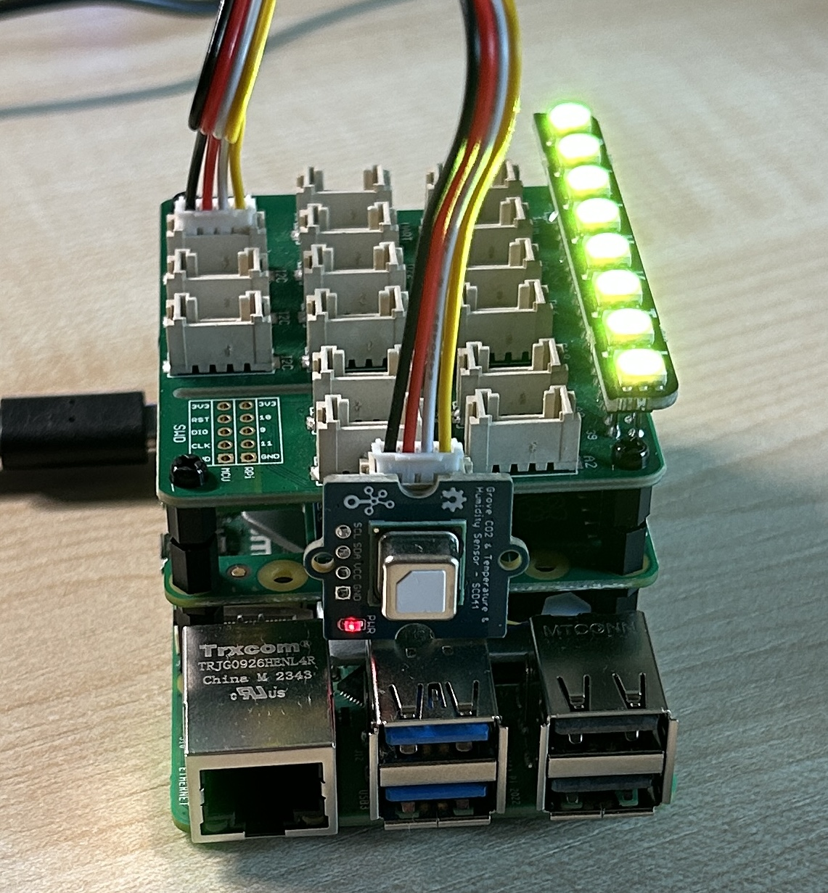

# CO2 sensor running on a Raspberry Pi and using Azure Event Grid

This repo contains a sample app to show how you can monitor CO<sub>2</sub> levels using a Raspberry Pi and C#, and send the data to Azure Event Grids. It also shows how to build an alert device that listens to the CO<sub>2</sub> readings and uses these to color an indicator light.



## Architecture

This repo contains 2 apps - a [Sensor](./src/Sensor/) app, and a [Monitor](./src/Monitor/) app. The sensor app detects CO<sub>2</sub> levels and sends them over MQTT to an Azure Event Grid. The Monitor app listens to these value also over MQTT and lights LEDs depending on the CO<sub>2</sub> level:

| Level     | Color  |
| --------- | ------ |
| <800      | Green  |
| 800-1200  | Yellow |
| 1200-1800 | Orange |
| >1800     | Red    |

The devices are authenticated using x.509 certificates.

## Hardware

This device is built around a Raspberry Pi. I'm using a Raspberry Pi 5 with 8GB of RAM, an active cooling fan and a 256GB SSD because I can, but you can run this on much lower power devices, anything from a Pi 2 onwards.

The CO<sub>2</sub> sensor is a SCD41. I'm using the one from [Seeed Studio](https://www.seeedstudio.com) with a Grove connector, and a Grove base hat. I also use a Blinkt from Pimoroni as an indicator. This is a strip of 8 RGB LEDs that plugs into the entire GPIO pin set.

- [Grove base hat](https://www.seeedstudio.com/Grove-Base-Hat-for-Raspberry-Pi.html)
- [SCD41 sensor](https://www.seeedstudio.com/Grove-CO2-Temperature-Humidity-Sensor-SCD41-p-5025.html)
- [Blinkt](https://shop.pimoroni.com/products/blinkt)

The SCD41 uses I<sup>2</sup>C, so needs to be connected to one of the ports labelled I<sup>2</sup>C - there are 3 on the opposite side to the GPIO pins.

> You can also get an SCD41 without the Grove connection. This can be connected to the relevant GPIO I<sup>2</sup>C pins.

## Software

The Raspberry Pi is running the latest Paspberry Pi OS. My apps are C# app, so it has .NET 8 installed. There is also some drivers for the Grove base hat to install that turns on the I<sup>2</sup>C interface.

To set up the Azure services, you can use the Azure CLI. This can also be installed on the Raspberry Pi if you want. The devices will connect to Azure using X.509 certificates, so if you don't already have one, you can use Step to create them. Step doesn't support Arm64, so you can't run it on a Raspberry Pi.

- [.NET install instructions](https://learn.microsoft.com/dotnet/core/tools/dotnet-install-script)
- [Grove Base Hat installtion and configuration](https://wiki.seeedstudio.com/Grove_Base_Hat_for_Raspberry_Pi/#installation)
- [Azure CLI](https://learn.microsoft.com/cli/azure/install-azure-cli-linux?pivots=apt)
- [Step CLI](https://smallstep.com/docs/step-cli/installation/)

Finally, clone this repo to your Raspberry Pi, and open it in something like VS Code.

## Cloud configuration

This setup uses an [Azure Event Grid](https://learn.microsoft.com/azure/event-grid/) as the MQTT broker.

### Create a resource group

All Azure respources live in a resource group. Use the [Azure CLI](https://learn.microsoft.com/cli/azure/) to create a resource group:

```bash
az group create --location westus3 \
                --resource-group rg-co2-sensor
```

This will create a resource group called `rg-co2-sensor` in the West US 3 region. Use your own name and preferred location if you want.

### Create the event grid

To create the event grid:

```bash
az eventgrid namespace create --name <name> \
                              --resource-group rg-co2-sensor \
                              --topic-spaces-configuration "{state:Enabled}"
```

Replace `<name>` with the name of your event grid. The name needs to be globally unique as this makes up part of the URL for the MQTT broker.

If you called your resource group something other than `rg-co2-sensor`, replace this too.

If you are asked to install the event grid extension, select Y to install this. This is needed to create event grids using the Azure CLI. The flag `--topic-spaces-configuration "{state:Enabled}"` will turn on the MQTT broker.

When this is created, the ourput will include a hostname for the MQTT server in the `topicSpacesConfiguration` section, as well as the location:

```json
{
  "topicSpacesConfiguration": {
    "hostname": "<name>.<location>.ts.eventgrid.azure.net",
    "maximumClientSessionsPerAuthenticationName": 1,
    "maximumSessionExpiryInHours": 1,
    "state": "Enabled"
  },
}
```

Make a note of this `hostname`. as you will need this to configure the apps.

### Create a topic space

Topic spaces are groupings of MQTT topics. By using spaces, you can manage access to groups of topics at once. To send and recieve data over MQTT, you need to define at least one topic space.

```bash
az eventgrid namespace topic-space create --name co2-topics \
                                          --namespace-name <event grid name> \
                                          --resource-group rg-co2-sensor \
                                          --topic-templates ["co2-readings"]
```

Set the `--namespace-name` to the name of your event grid namespace. If you called your resource group something other than `rg-co2-sensor`, replace this too.

This will create a topic space called `co2-topics` that allows you to publish and subscribe to `co2-readings`.

### Create X.509 certificates

To authenticate the device, you will need an X.509 certificate. Each device can have its own cert, or can share a cert. In this case, to make things easier, they sensor and monitor apps will share a cert.

From another device (not your Raspberry Pi), make sure you have the [Step CLI](https://smallstep.com/docs/step-cli/installation/#testing-your-installation) installed. This doesn't support ARM64, so cannot run on a Pi.

1. Create a root and intermediate certificate:

    ```bash
    step ca init --deployment-type standalone \
                 --name MqttAppSamplesCA \
                 --dns localhost \
                 --address 127.0.0.1:443 \
                 --provisioner MqttAppSamplesCAProvisioner
    ```

    This creates the certificate with the name `MqttAppSamplesCA` and  provisioner `MqttAppSamplesCAProvisioner` - you can change these if you want. You will be asked for a password.

1. Once you have the root CA, generate a certificate:

    ```bash
    step certificate create sensor-cert sensor-cert.pem sensor-cert.key --ca .step/certs/intermediate_ca.crt \
                                                                        --ca-key .step/secrets/intermediate_ca_key \
                                                                        --no-password \
                                                                        --insecure \
                                                                        --not-after 2400h
    ```

    You will be asked for the password you set in the previous step.

1. Get the thumbprint for the cert:

    ```bash
    step certificate fingerprint sensor-cert.pem
    ```

1. Copy the generated `sensor.pem` and `sensor.key` files to your Raspberry Pi. Put them in the root folder of this repo.

### Create the MQTT clients

For a client, such as a sensor device, to connect, it needs to be enabled as a client on the event grid. This client is configured with the thumbprint from the certificate to authenticate it.

1. Create the sensor client:

    ```bash
    az eventgrid namespace client create --namespace-name <event grid name> \
                                         --resource-group rg-co2-sensor \
                                         --name co2-sensor \
                                         --client-certificate-authentication "{validationScheme:ThumbprintMatch,allowed-thumbprints:[<sensor thumbprint>]}"
    ```

    Set the `--namespace-name` to the name of your event grid namespace. If you called your resource group something other than `rg-co2-sensor`, replace this too.

    Replace `<sensor thumbprint>` in the `--client-certificate-authentication` value with the thumbprint for the certificate. This is an array of values, so you need the surrounding square brackets.


1. Create the monitor client in the same way:

    ```bash
    az eventgrid namespace client create --namespace-name <event grid name> \
                                         --resource-group rg-co2-sensor \
                                         --name co2-monitor \
                                         --client-certificate-authentication "{validationScheme:ThumbprintMatch,allowed-thumbprints:[<sensor thumbprint>]}"
    ```

    Set the `--namespace-name` to the name of your event grid namespace. If you called your resource group something other than `rg-co2-sensor`, replace this too.

    Replace `<sensor thumbprint>` in the `--client-certificate-authentication` value with the thumbprint for the certificate, the same as in the previous step.

### Create permission bindings

The last step is to grant permissions to clients to publish or subscribe on different topic spaces. Permissions are set on client groups, rather than on individual clients. There is a client group name called `$all` that includes all clients, so it's easier for a simple app like this to grant permission on this client group to publish and subscribe to the topic space.

Permission bindings have to be created for either publish or subscribe, so you will need to create 2.

1. Create the permission binding for publishing:

    ```bash
    az eventgrid namespace permission-binding create --namespace-name <event grid name> \
                                                     --resource-group rg-co2-sensor \
                                                     --name c02-sensor-binding-publisher \
                                                     --client-group-name '$all' \
                                                     --permission publisher \
                                                     --topic-space-name co2-topics
    ```

1. Create the permission binding for subscribing:

    ```bash
    az eventgrid namespace permission-binding create --namespace-name <event grid name> \
                                                     --resource-group rg-co2-sensor \
                                                     --name c02-sensor-binding-subscriber \
                                                     --client-group-name '$all' \
                                                     --permission subscriber \
                                                     --topic-space-name co2-topics
    ```

### Configure the sensor and monitor apps

You will need to set some configuration in the sensor and monitor apps. These are in the [src/Sensor](./src/Sensor/), and [src/Monitor](./src/Monitor/) folders.

1. Copy the `appsettings.json.example` file to `appsettings.json` in each folder.
1. In these files, set the following:

    ```json
    {
      "Hostname": <the hostname of the MQTT server>,
      "Topic": "co2-readings",
      "X509Pem": "../../sensor-cert.pem",
      "X509Key": "../../sensor-cert.key",
    }
    ```

    Set `"Hostname"` to the hostname of the MQTT server. This is the `hostname` from the output of the event grid creation. The paths to the `sensor-cert.pem` and `sensor-cert.key` files assume you placed these files in the root of where you cloned this repo.

1. In the `appsettings.json` file in the `Sensor` folder, set the following:

    ```json
    {
      ...
      "ClientId": "co2-sensor",
    }
    ```

1. In the `appsettings.json` file in the `Monitor` folder, set the following:

    ```json
    {
      ...
      "ClientId": "co2-monitor",
    }
    ```

Once the `appsettings.json` files are configured, you can run the sensor and monitor.

1. To run the sensor:

    ```bash
    cd src/Sensor
    dotnet run
    ```

1. To run the monitor:

    ```bash
    cd src/Monitor
    dotnet run
    ```

You will see the output from the sensor showing the CO<sub>2</sub> values, and the output from the monitor reading these values. The LEDs will also light up to show the CO<sub>2</sub> level.

You can show the CO<sub>2</sub> levels changing by breathing on the sensor - your breath is high in CO<sub>2</sub>, so by gently breathing on the sensor, the CO<sub>2</sub> levels will go up and the LEDs will change to red.
